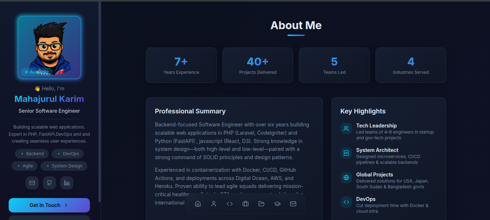
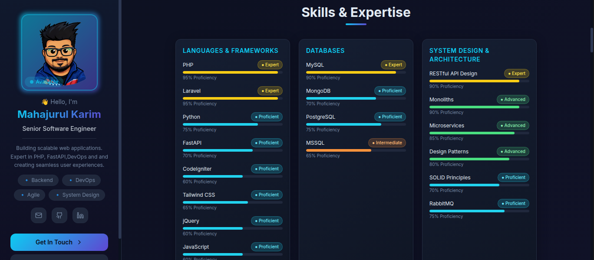
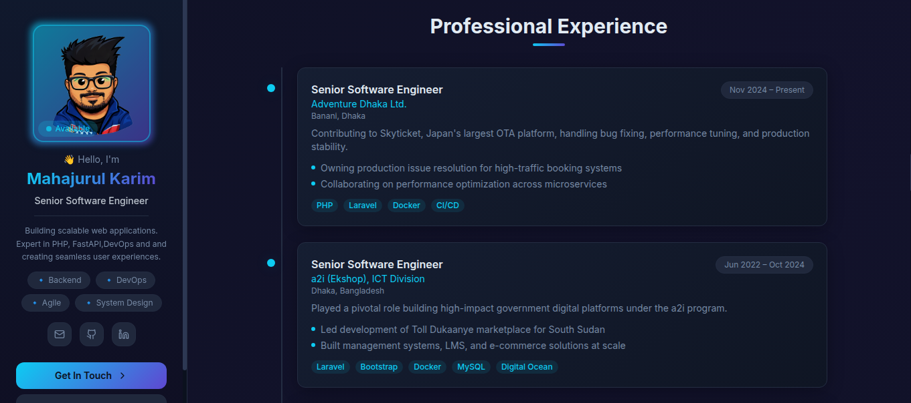
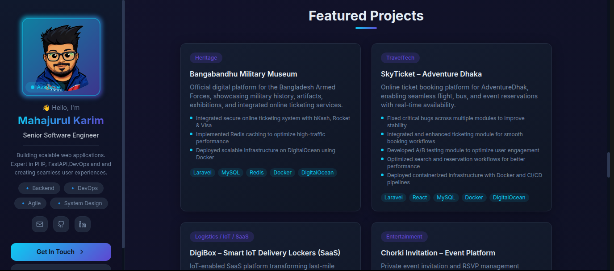
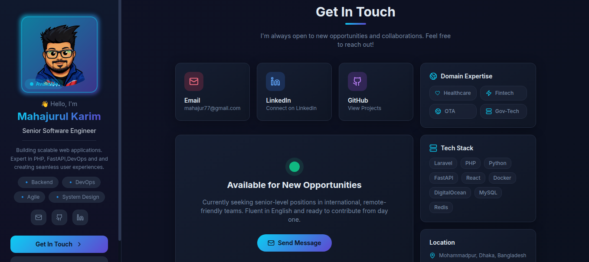

<h1 align="center">Mahajurul Karim — Portfolio</h1>

<p align="center">
  <a href="https://mahakarim.pro.bd" target="_blank"></a>
  
  
  
  
</p>

<br/>

> Personal portfolio website of **Mahajurul Karim**, Senior Software Engineer specializing in PHP, Laravel, Python, FastAPI, and DevOps. Built with React + TypeScript + Tailwind CSS.

<br/>

## 🖥️ Preview

<p align="center">
  <a href="https://mahakarim.pro.bd" target="_blank">
    
  </a>
</p>

<p align="center">
  
  
</p>

<p align="center">
  
  
</p>

<p align="center">
  <a href="https://mahakarim.pro.bd" target="_blank">
    
  </a>
</p>

<br/>

## ✨ Features

- Responsive design — works on all screen sizes
- Animated sidebar with profile, social links, and CV download
- Sections: About, Skills, Experience, Projects, Education, Contact
- Dark-themed UI with gradient accents
- SEO optimized with Open Graph & Twitter Card meta tags
- Downloadable CV (PDF)
- Smooth scroll animations powered by Framer Motion

<br/>

## 🛠️ Tech Stack

| Category | Technologies |
|----------|-------------|
| Frontend | React 18, TypeScript, Vite |
| Styling | Tailwind CSS, shadcn/ui |
| Animation | Framer Motion |
| Icons | Lucide React |
| Build | Vite 5 |
| Deployment | cPanel / Apache |

<br/>

## 🚀 Getting Started

```bash
# Clone the repository
git clone https://github.com/inversemaha/portfolio.git

# Navigate to project directory
cd portfolio

# Install dependencies
npm install

# Start development server
npm run dev

# Build for production
npm run build
```

<br/>

## 📁 Project Structure

```
src/
├── assets/              # Images, CV PDF
├── components/
│   └── portfolio/       # All section components
│       ├── Sidebar.tsx
│       ├── AboutSection.tsx
│       ├── SkillsSection.tsx
│       ├── ExperienceSection.tsx
│       ├── ProjectsSection.tsx
│       ├── EducationSection.tsx
│       └── ContactSection.tsx
├── pages/
│   └── Index.tsx
└── main.tsx
```

<br/>

## 📬 Contact

- 🌐 Website: [mahakarim.pro.bd](https://mahakarim.pro.bd)
- 📧 Email: mahajur77@gmail.com
- 💼 LinkedIn: [linkedin.com/in/maha-karim](https://www.linkedin.com/in/maha-karim)
- 🐦 X (Twitter): [@inversemaha](https://x.com/inversemaha)
- 🐙 GitHub: [@inversemaha](https://github.com/inversemaha)

<br/>

## 📄 License

This project is open source and available under the [MIT License](LICENSE).

---

<p align="center">Designed & Built by <strong>Mahajurul Karim</strong> 🚀</p>
